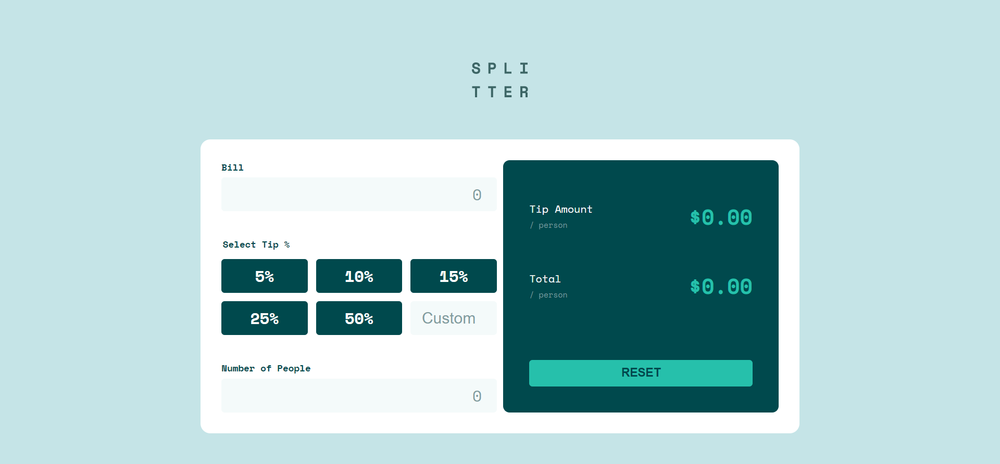

# Frontend Mentor - Tip calculator app solution

This is a solution to the [Tip calculator app challenge on Frontend Mentor](https://www.frontendmentor.io/challenges/tip-calculator-app-ugJNGbJUX). Frontend Mentor challenges help you improve your coding skills by building realistic projects.

## Table of contents

- [Overview](#overview)
  - [The challenge](#the-challenge)
  - [Screenshot](#screenshot)
  - [Links](#links)
- [My process](#my-process)
  - [Built with](#built-with)
  - [What I learned](#what-i-learned)
  - [Continued development](#continued-development)
  - [Useful resources](#useful-resources)
- [Author](#author)

## Overview

### The challenge

Users should be able to:

- View the optimal layout for the app depending on their device's screen size
- See hover states for all interactive elements on the page
- Calculate the correct tip and total cost of the bill per person

### Screenshot

### Links

- Solution URL: [Solution website](https://billbahr.github.io/tip-calculator-app/)

## My process

### Built with

- HTML
- CSS
- Flexbox
- CSS Grid
- vanilla Javascript

### What I learned

I definitely improved my CSS layout skills with this challenge. I spent a lot of time working with both Flex and Grid trying to get the layout to match the design. 

I also learned to read all the directions more carefully. I missed the style guide at first and spent too much time trying to match the design color palette and fonts manually.

### Continued development

I still need to get a lot more comfortable with CSS layout options, including Flex and Grid. I also think I could spend some time cleaning up my final CSS, which probably has duplicative attributes. For example, I feel like I had to declare the font-family and font-weight over and over again when inheritance could've taken care of some of those.

The final product needs a lot more data validation and error messages too (more than none that is).

### Useful resources

- [CSS Tricks](https://css-tricks.com/) - An amazing website for all kinds of CSS info. It helped me a lot with my layout, and figuring out appropriate Flex and Grid properties.
- [Getting Started with CSS](https://frontendmasters.com/courses/getting-started-css/) - This is the course that really helped start figuring out CSS layouts. All the Frontend Masters courses are awesome, and Jen Kramer is a great teacher.
- [Advanced CSS Layouts](https://frontendmasters.com/courses/advanced-css-layouts/) - This is my next step after the previous course. I've only gotten through the Grid & Flexbox Review section so far, but that part was really helpful when I was struggling to get my layout working right.

## Author

- Frontend Mentor - [@billbahr](https://www.frontendmentor.io/profile/billbahr)
- Twitter - [@billbahr](https://www.twitter.com/billbahr)

